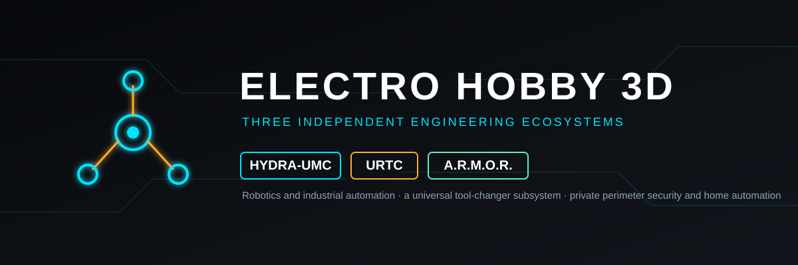

<p align="center">
  
</p>

# 🧩 ELECTRO-HOBBY-3D-UPDATER

<p align="center">
  <a href="README.md">🇺🇸 English</a> |
  <a href="README_fra.md">🇫🇷 Français</a> |
  <a href="README_spa.md">🇪🇸 Español</a> |
  <a href="README_ita.md">🇮🇹 Italiano</a> |
  <b>🇩🇪 Deutsch</b> |
  <a href="README_zho.md">🇨🇳 简体中文</a> |
  <a href="README_jpn.md">🇯🇵 日本語</a>
</p>

### Eine einzige Kommandozeile fuer alle drei Electro-Hobby-3D-Oekosysteme - Oekosystem waehlen, seine Pakete herunterladen und aktualisieren

<p align="center">
  
  
  
  
  
</p>

---

**Ehrlichkeitspruefung - was heute laeuft:** **Reifegrad: Geruest.** Dies ist ein duenner Dispatcher, keine vierte Implementierung der Oekosystem-Erkennung: er enthaelt keine eigene Manifest-Analyse-, Installations- oder Aktualisierungslogik. `dispatch()` und sein Befehlsaufbau (10 Tests, alle gegen einen simulierten Subprozess-Runner) sind real und getestet; `status --ecosystem all` wurde echt gegen ein reales Checkout aller drei Oekosysteme ausgefuehrt (55 HYDRA-UMC-, 7 URTC- und 15 A.R.M.O.R.-Repositories korrekt gefunden) - `install`/`update` noch nicht. Ein echter Fehler wurde bei diesem ersten echten Lauf gefunden und behoben: siehe den `--workspace`-Eintrag in `CHANGELOG.md`.

---

## 🎯 Ueberblick

* **Ein Werkzeug, drei echte Oekosysteme:** [HYDRA-UMC](https://github.com/JuanenRac/HYDRA-UMC-UPDATER), [URTC](https://github.com/JuanenRac/URTC-UPDATER) und [A.R.M.O.R.](https://github.com/JuanenRac/ARMOR-UPDATER) haben bereits jeweils ihren eigenen, unabhaengig getesteten Updater. Dieses Projekt implementiert nichts davon neu - es installiert alle drei als echte Abhaengigkeiten (direkt von ihren eigenen GitHub-Repositories) und leitet `--ecosystem hydra-umc|urtc|armor` an den passenden weiter.
* **Jedes Mal ein echter, separater Subprozess.** Jeder Aufruf fuehrt `python -m <Modul dieses Oekosystems> --cli ...` als eigenen Interpreter-Prozess aus - importiert niemals das `main()` einer anderen CLI in denselben Prozess. Drei unabhaengige argparse-Programme, jedes frei, `sys.argv` zu lesen und `sys.exit()` aufzurufen, wuerden sich gegenseitig beschaedigen, wenn sie im selben Prozess kombiniert wuerden; ein Subprozess bietet dieselbe Isolation wie eine Person, die jeden Befehl von Hand eingibt.
* **`status --ecosystem all`:** das Einzige, was dieses Werkzeug tut, das kein einzelner Sub-Updater fuer sich allein tut - fuehrt die Statuspruefung aller drei Oekosysteme nacheinander aus und meldet, welche(s) fehlgeschlagen ist, ohne beim ersten anzuhalten.
* **`install`/`update` brauchen immer genau ein Oekosystem und einen Projektnamen.** Es gibt hier kein "alles in jedem Oekosystem aktualisieren", dieselbe nicht verhandelbare Haltung, die die eigene CLI jedes Sub-Updaters fuer seine eigenen Projekte bereits einnimmt.

## 📂 Repository-Struktur

```text
ELECTRO-HOBBY-3D-UPDATER/
├── src/electro_hobby_3d_updater/
│   ├── ecosystems.py   # Der einzige Ort, der die drei echten Oekosysteme und ihr CLI-Modul benennt
│   ├── main.py         # argparse-CLI + dispatch() - baut den richtigen Subprozess-Befehl auf und fuehrt ihn aus
│   ├── i18n.py         # Die Texte des Fensters in den sieben Sprachen
│   ├── qt_gui.py       # Qt-Quick-Fenster (eine Karte je Oekosystem, ein Protokoll) - oeffnet den Updater des jeweiligen Oekosystems
│   └── qml/Main.qml    # Das QML des Fensters
├── tests/               # 12 Tests gegen einen simulierten Subprozess-Runner
├── tools/               # ci_validate.py, build_test.py, _doc_policy.py, _readme_parity.py
├── build.sh / build.bat         # venv + editierbare Installation (holt die 3 echten Abhaengigkeiten) + Kompilierungspruefung
├── build-test.sh / build-test.bat  # gleiche Installation, dann die echte pytest-Suite
└── run.sh / run.bat              # CLI-Einstiegspunkt (ohne Argumente: das Fenster)
```

## 🛠️ Entwicklungsumgebung

```bash
pip install -e ".[dev]"                 # installiert auch hydra-umc-updater, urtc-updater und armor-updater von GitHub
python -m pytest tests -q               # 10 Tests, ohne Netzwerk oder echten Subprozess
electro-hobby-3d-updater status --ecosystem all               # prueft alle drei Oekosysteme nacheinander
electro-hobby-3d-updater status --ecosystem armor             # prueft nur eines
electro-hobby-3d-updater install --ecosystem urtc URTC-TESTER # klont und baut ein noch nicht installiertes Projekt
electro-hobby-3d-updater update  --ecosystem hydra-umc HYDRA-UMC-SERVER # aktualisiert und baut ein bereits installiertes Projekt neu
```

## 🔗 Verwandte Projekte

Dieses Werkzeug ist das vierte Stueck von JuanenRacs (Electro Hobby 3D) eigener Updater-Familie - es umhuellt die anderen drei, statt eines von ihnen zu ersetzen:

* **[HYDRA-UMC-UPDATER](https://github.com/JuanenRac/HYDRA-UMC-UPDATER)** - erkennt, installiert und aktualisiert die eigenen Repositories des HYDRA-UMC-Oekosystems
* **[URTC-UPDATER](https://github.com/JuanenRac/URTC-UPDATER)** - erkennt, installiert und aktualisiert die eigenen Repositories des URTC-Oekosystems
* **[ARMOR-UPDATER](https://github.com/JuanenRac/ARMOR-UPDATER)** - erkennt, installiert und aktualisiert die eigenen Repositories des A.R.M.O.R.-Oekosystems
* **ELECTRO-HOBBY-3D-UPDATER** (dieses Repository) - leitet an das vom Nutzer gewaehlte der drei weiter

Und die drei echten Oekosysteme selbst: **[HYDRA-UMC](https://github.com/JuanenRac/HYDRA-UMC)** (industrielle Multi-Roboter-Steuerung), **[URTC](https://github.com/JuanenRac/URTC)** (die Universal-Robot-Tool-Controller-Plattform), **[A.R.M.O.R.](https://github.com/JuanenRac/ARMOR-COMMON)** (Perimeter-Sicherheit und Hausautomation).

## 📚 Dokumentation und Community

* **[Aenderungsprotokoll dieses Repositories](CHANGELOG.md)**
* Fragen, Ideen und Meldungen: electrohobby3d@gmail.com

## 👤 AUTOR

**JuanenRac (Electro Hobby 3D)** · electrohobby3d@gmail.com

## 📜 LIZENZ

GPL-3.0-or-later - siehe [LICENSE](LICENSE).
